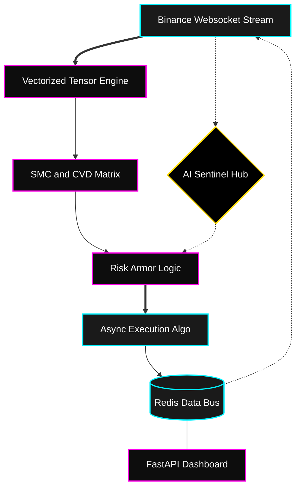

  

<h1 align="center">🚀 X-VOID Omega: Institutional-Grade Crypto Quant System</h1>

  
  
  
  

  <strong>X-VOID Omega</strong> 是一套专为中高频波动率捕获而设计的分布式量化交易系统。系统集成了 **SMC (聪明钱概念)**、**CVD 订单流审计**以及 **LLM 异步推理引擎**，实现了从宏观情绪感知到微观亚毫秒执行的完整闭环。

---
# 🚀 X-VOID Omega: Institutional-Grade Crypto Quant System

> [!IMPORTANT]
> **声明**：这不是一个简单的炒币脚本。** 这是一个基于 **NumPy 向量化引擎** 的工程级资产管理工具，旨在提供极端的稳定性、对冲功能和 AI 驱动的控制。

## 🏗️ 核心架构图 (Core Architecture)

🌟 核心技术矩阵 (Core Technical Matrix)
1. 🩸 极致的算法同源 (Zero-Drift Engine Parity)
“回测即实盘，所见即所得。” 系统消除了量化交易中最致命的“环境不一致性”。

纯 NumPy 向量化流控：实盘引擎摒弃了传统的循环逐行处理逻辑，将实时 Websocket 数据直接映射进与回测引擎完全一致的 NumPy C-扩展张量中。这意味着每一根 K 线的指标计算在数学层面上与历史回测实现 Bit-for-Bit (逐位对齐)，彻底解决信号漂移难题。

1:1 物理级高保真模拟：

全仓保证金模拟 (Cross-Margin Simulation)：回测逻辑内置了动态预估强平价计算，完美复刻币安合约的阶梯保证金制度。

滑点审计与微观流动性：基于 L2 订单簿深度的 VWAP 滑点模拟，能够真实反馈在大额订单下的成交磨损。

时钟一致性熔断：回测系统同步了 48 小时的“黑天鹅冷却时间锁”，确保在回放历史极端行情时，策略的停火逻辑得到真实演练。

2. 🛡️ 机构级风控护甲 (The Fortress: Quantitative Risk Control)
“在波动中生存，在确定性中增压。” 系统内置了多层级、多维度的风险阻断算法。

三阶段动态止损 (TSL - Tri-Stage Guardian)：

Stage 1 (初始护盾)：基于 ATR 的自适应物理止损，过滤市场震荡噪音。

Stage 2 (动态保本)：当浮盈触及波动率阈值，止损线自动上移至 Entry ± 微利偏移，确保单笔交易不再由盈转亏。

Stage 3 (利润收割)：锁定高位插针极值点（Highest/Lowest Price），以移动追踪模式最大程度捕获单边趋势的尾部利润。

净敞口 Delta 管理 (Net Delta Circuit Breaker)：系统超越了单一品种的风险考量。通过 Net_Delta 算法，实时统计账户的总名义价值暴露。当全账户做多/做空比例失衡（例如超过 0.7 净敞口）时，系统将强行拦截同向新订单，强迫资产进入对冲态势。

黑天鹅主动扫描仪：实时审计价格跳空 (Gap)、分钟级极端振幅、以及相对于 20 日均量的天量异动。一旦触发高维波动率预警，系统将进入“堡垒模式”，自动挂起所有策略循环 48 小时。

3. 🧠 AI 智能哨兵 (The Neural Overseer: LLM Intelligence)
“赋予冰冷代码以‘盘感’。” 利用大模型的逻辑推理能力作为决策的最后一道终审。

异步决策链路 (Agentic Multi-LLM Inference)：

集成 Claude-4.6-Sonnet/Opus 负责长文本逻辑链推理，对宏观政经数据进行深度“天气预报”。

集成 Google Gemini 3.1 Pro：利用其超长上下文能力，负责扫描全网地缘政治研报，并对历史 K 线形态进行多模态视觉复盘。

集成 DeepSeek-R1 PRO 执行极速的市场情绪审计，过滤由于链上虚假消息引发的短线信号。

零延迟架构：LLM 推理运行在独立的异步工作线程中，绝不阻塞核心交易循环的心跳。

弹性边界自适应 (Market Regime Adaptation)：

AI 会自动识别当前市场处于“单边、震荡、或极端恐慌”哪种状态 (Regime)。

根据识别结果，AI 会动态收缩或扩张策略边界：在高波动环境下自动撑大 ATR 止损倍数，在低迷期自动收紧 ADX 入场门槛，实现真正的“全天候自愈”。

4. ⚔️ 自适应“幽灵”执行算法 (Ghost Execution & Order Chasing)
“不留残仓，不计成本，只为吃满。” 针对高波动标的（SOL/PEPE 等）设计的极致执行层。

智能追单协程 (Async Order Chasing)：系统在执行紧急信号时，不再使用低效的等待模式。若首笔 IOC (Immediate or Cancel) 订单未能全额成交，系统将瞬间启动追单协程，每隔 
3 秒锚定买一/卖一盘口进行动态挂单重试，直至仓位完全填满。

盘口流动性深度审计：在每一笔订单下达前，系统会对 L2 订单簿进行毫秒级扫描，计算 VWAP 真实滑点。若当前深度无法支撑目标仓位，系统会自动将订单拆分为多个微量原子单，防止引

发盘口瞬间崩塌。

5. 🏗️ 分布式实时状态总线 (High-Concurrency Redis Bus)
“零延迟监控，断电级数据不坏金身。” * Redis Pub/Sub 信号流：核心交易引擎与 Web UI 之间彻底摒弃了传统的 HTTP 轮询模式，改用 Redis 发布/订阅机制。每一笔成交、每一个信号的闪烁都会以 < 5ms 的延迟直达你的指挥部仪表盘。

Write-Ahead Logging (WAL) 账本同步：参考了数据库级别的日志保护逻辑。系统在更新沙盒余额或实盘持仓的瞬间，会同时向 Redis 和物理磁盘执行 fsync 强制落盘，确保即便服务器意外宕机，重启后的“利滚利”对账精度依然能达到 10^-8。

🛠️ 快速启动 (Quick Start)

环境配置 (Setup):

Bash
git clone https://github.com/xykdoog/-X-VOID-Institutional-Grade-Crypto-Quant-System-.git
cd X-VOID-Omega
pip install -r requirements.txt
配置密钥 (Config):
将 .env.example 重命名为 .env，并填入你的 API 密钥。

运行 (Run):

Bash
python main.py  # 启动交易引擎 (Trading Engine)
python dashboard.py # 启动 Web 监控面板 (Web Dashboard)

📜 免责声明 (Disclaimer)

量化交易存在极高风险。本系统仅供技术研究与沙盒演习使用，不构成任何投资建议。统帅提醒：在实盘运行前，请务必在模拟盘完成充足测试。

⚖️ 强制性开源协议 (GPL-3.0 Copyleft Policy)
[!CAUTION]
声明：本项目采用 GNU GPL v3.0 协议授权。

这是一份带有“强迫性回馈”性质的协议。 X-VOID Omega 的技术血统受此协议严格保护，所有使用者必须遵守：

分发即开源：如果你修改了本系统的任何核心逻辑（如改写了信号算法 或风控模型）并向他人分发或提供服务，你必须以 GPL-3.0 协议无条件公开你修改后的全部源代码。

拒绝闭源私吞：严禁将本系统剥离核心逻辑后包装成付费闭源软件。任何基于本项目的衍生品，其“自由度”必须与本项目完全一致。

技术主权：我们欢迎商业使用，但任何试图利用本项目技术优势却拒绝回馈社区的行为，都将受到法律与开源社区的共同追责。

🚀 X-VOID Omega: Institutional-Grade Crypto Quant System
Commander's Directive: This is not a mere script; it is an engineering-grade asset management fortress built on a Vectorized NumPy Engine. Designed for extreme stability, mandatory hedging, and AI-driven self-healing boundaries.

🌟 Core Technical Matrix
1. 🩸 Zero-Drift Engine Parity
"Backtest as Live, Execution as Intended."

Bit-for-Bit Vectorized Flow: Unlike traditional loop-based systems, X-VOID Omega maps real-time WebSocket streams directly into the same NumPy C-extension tensors used by the backtest engine. This ensures indicator calculations achieve Bit-for-Bit parity, effectively eliminating signal drift at the physical level.

High-Fidelity Physical Simulation:

Cross-Margin Liquidation Modeling: Built-in dynamic liquidation price estimation, perfectly replicating exchange-tier margin tiering.

Black Swan Circuit Breakers: A synchronized 48-hour "Cool-Down" protocol for extreme market events, ensuring survival strategies are tested under real-world stress.

2. 🛡️ Institutional Risk Armor
Tri-Stage Guardian (TSL): An ATR-based volatility defense system. Stage 1: Initial Noise Filter; Stage 2: Dynamic Break-even Lock; Stage 3: Extremum Spike Harvest—squeezing maximum profit from the tail of a trend.

Global Net Delta Management: Real-time auditing of total account notional exposure. When net delta imbalances are detected, the system forcibly intercepts directional orders and mandates a hedge-state to prevent systemic drawdowns.

3. 🧠 The Neural Overseer (AI Sentinel Hub)
Triple-Model Asynchronous Matrix:

Google Gemini 1.5 Pro: Leverages massive context windows for global macro report scanning and multi-modal K-line pattern recognition.

Anthropic Claude 3.5 Sonnet: Acts as the "Logic Judge" for deep certainty audits of SMC (Smart Money Concepts) signals.

DeepSeek-R1: Rapid sentiment analysis, filtering on-chain noise and identifying whale movement anomalies.

Market Regime Adaptation: The AI autonomously re-calibrates strategy boundaries (e.g., ADX thresholds and ATR multipliers) based on the current market regime: Trending, Ranging, or Panic.

4. ⚔️ Adaptive "Ghost" Execution
Async Order Chasing: An ultra-responsive execution layer. If a limit order isn't fully filled, the system deploys an asynchronous chaser that dynamically re-anchors to the Best-Bid-Offer (BBO) every 3 seconds.

L2 Liquidity Audit: Millisecond scans of top-100 order book tiers to calculate VWAP slippage, automatically fragmenting large orders to avoid market impact.

⚖️ Mandatory Open Source Policy (GPL-3.0)
[!CAUTION]
X-VOID Omega is licensed under GNU GPL v3.0.

This is a Reciprocal License. By utilizing this codebase, you agree to the following:

Share-Alike: If you modify the core logic (Signal Matrix or Risk Models) and provide services to others, you MUST release your full source code under GPL-3.0.

No Proprietary Hijacking: Commercial use is permitted, but stripping the engine for closed-source paid software is strictly prohibited.

Technical Sovereignty: We welcome contributors; we hunt violators.
